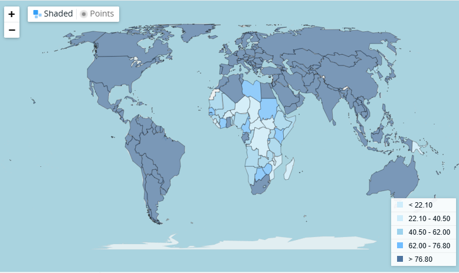

# 2025/W33 Access to Electricity (% of Population)

**Data (data.world):** [https://data.world/makeovermonday/2025w33-access-to-electricity-of-population](https://data.world/makeovermonday/2025w33-access-to-electricity-of-population)

**Article / original viz:** [https://data.worldbank.org/indicator/EG.ELC.ACCS.ZS?view=map](https://data.worldbank.org/indicator/EG.ELC.ACCS.ZS?view=map)

**Original data source:** [https://data.worldbank.org/indicator/EG.ELC.ACCS.ZS?view=map](https://data.worldbank.org/indicator/EG.ELC.ACCS.ZS?view=map)

**Dataset:** `makeovermonday/2025w33-access-to-electricity-of-population`  
**Last updated on data.world:** 2025-08-11T07:54:47.039291871Z

---

% of population who have access to electricity.

---
{"editor":"simple"}
---
# Original Vizualisation
​

Datasource: [World Bank Group](https://data.worldbank.org/indicator/EG.ELC.ACCS.ZS?view=map)

Article: [World Bank Group](https://blogs.worldbank.org/en/voices/How-to-close-Africa-energy-access-gap)