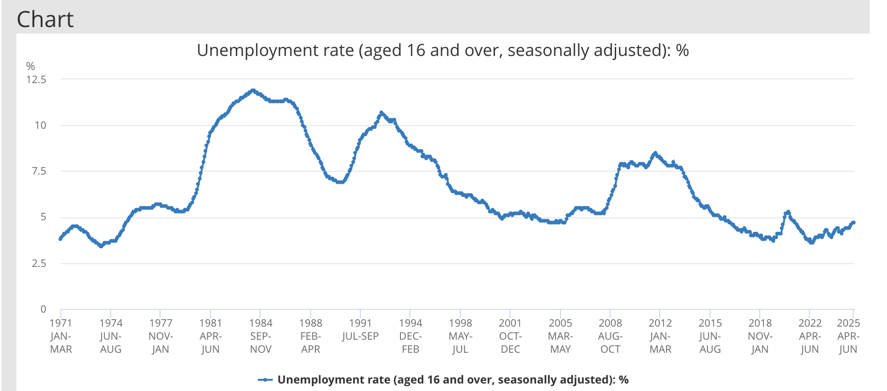

# 2025/ week 34 Unemployment Rate

**Data (data.world):** [https://data.world/makeovermonday/2025-week-34-unemployment-rate](https://data.world/makeovermonday/2025-week-34-unemployment-rate)

**Article / original viz:** [https://www.ons.gov.uk/employmentandlabourmarket/peoplenotinwork/unemployment/timeseries/mgsx/lms?utm_source=chatgpt.com](https://www.ons.gov.uk/employmentandlabourmarket/peoplenotinwork/unemployment/timeseries/mgsx/lms?utm_source=chatgpt.com)

**Original data source:** [https://www.ons.gov.uk/employmentandlabourmarket/peoplenotinwork/unemployment/timeseries/mgsx/lms?utm_source=chatgpt.com](https://www.ons.gov.uk/employmentandlabourmarket/peoplenotinwork/unemployment/timeseries/mgsx/lms?utm_source=chatgpt.com)

**Dataset:** `makeovermonday/2025-week-34-unemployment-rate`  
**Last updated on data.world:** 2025-08-18T17:30:06.654164575Z

---

---
{"editor":"simple"}
---
Source: ONS UK [https://www.ons.gov.uk/employmentandlabourmarket/peoplenotinwork/unemployment/timeseries/mgsx/lms](https://www.ons.gov.uk/employmentandlabourmarket/peoplenotinwork/unemployment/timeseries/mgsx/lms)?

​

