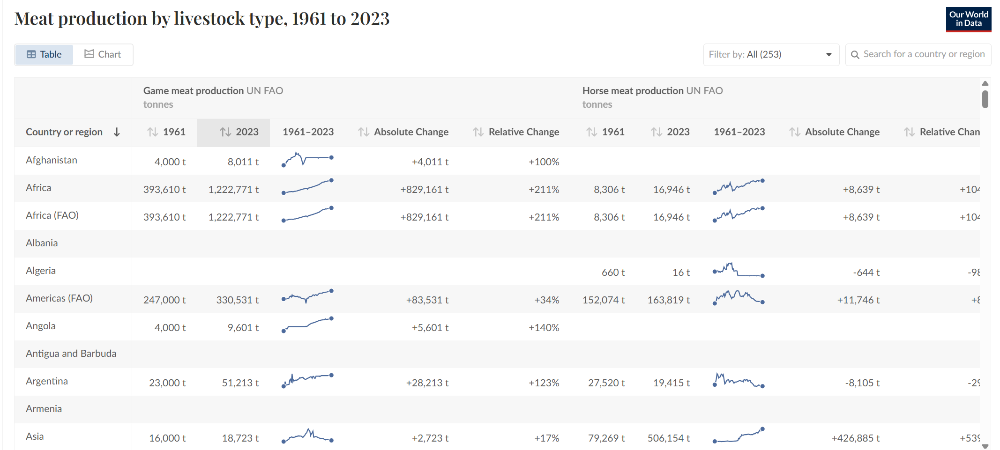

# 2025 / Week 35 Meat Production by Livestock Type

**Data (data.world):** [https://data.world/makeovermonday/meat-production-by-livestock-type](https://data.world/makeovermonday/meat-production-by-livestock-type)

**Article / original viz:** [https://ourworldindata.org/meat-production](https://ourworldindata.org/meat-production)

**Original data source:** [https://ourworldindata.org/meat-production](https://ourworldindata.org/meat-production)

**Dataset:** `makeovermonday/meat-production-by-livestock-type`  
**Last updated on data.world:** 2025-08-25T20:52:15.343119654Z

---

Global meat production by livestock type

---
{"editor":"simple"}
---
# Original Vizualisation

​

​

Datasource + Article: [Meat and Dairy Production - Our World in Data](https://ourworldindata.org/meat-production)