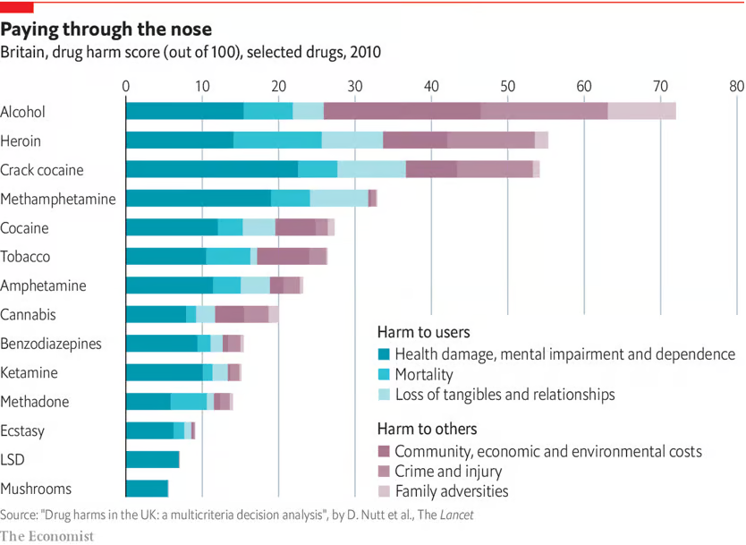

# 2025/W36 Drug Harms in the UK

**Data (data.world):** [https://data.world/makeovermonday/2025w36-drug-harms-in-the-uk](https://data.world/makeovermonday/2025w36-drug-harms-in-the-uk)

**Article / original viz:** [https://www.economist.com/graphic-detail/2019/06/25/what-is-the-most-dangerous-drug](https://www.economist.com/graphic-detail/2019/06/25/what-is-the-most-dangerous-drug)

**Original data source:** [https://www.thelancet.com/article/S0140-6736(10)61462-6/fulltext](https://www.thelancet.com/article/S0140-6736(10)61462-6/fulltext)

**Dataset:** `makeovermonday/2025w36-drug-harms-in-the-uk`  
**Last updated on data.world:** 2025-09-02T10:02:07.929106882Z

---

Drug harms in the UK: a multicriteria decision analysis (score out of 100)

---
{"editor":"simple"}
---
# Original Vizualisation
​

Article: [The Economist](https://www.economist.com/graphic-detail/2019/06/25/what-is-the-most-dangerous-drug)

Data: [The Lancet](https://www.thelancet.com/article/S0140-6736(10)61462-6/fulltext)