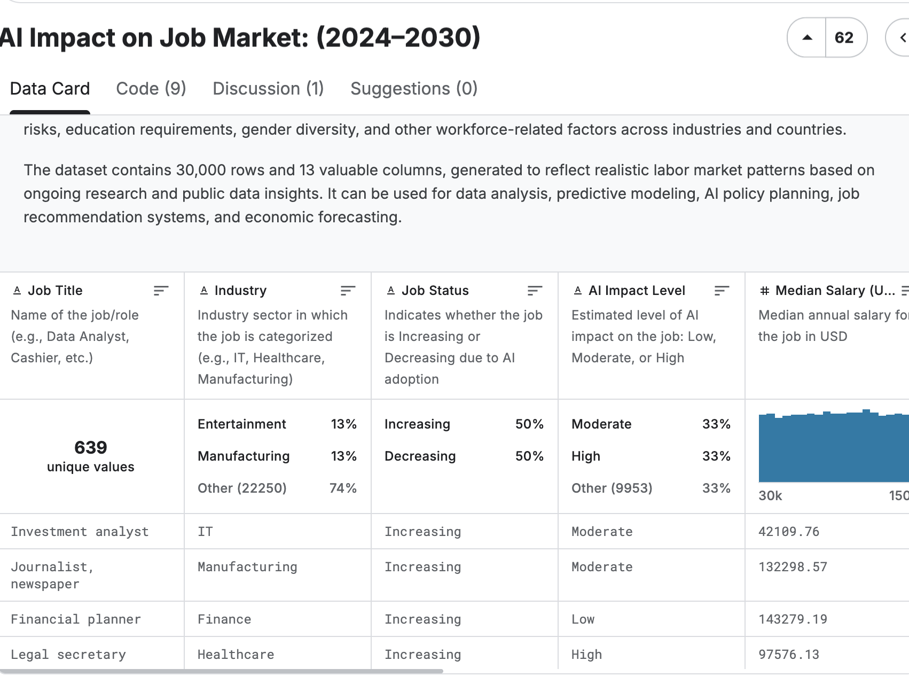

# 2025/week 37 AI job trends

**Data (data.world):** [https://data.world/makeovermonday/2025week-37](https://data.world/makeovermonday/2025week-37)

**Article / original viz:** [https://www.kaggle.com/datasets/sahilislam007/ai-impact-on-job-market-20242030?](https://www.kaggle.com/datasets/sahilislam007/ai-impact-on-job-market-20242030?)

**Original data source:** [https://www.kaggle.com/datasets/sahilislam007/ai-impact-on-job-market-20242030?](https://www.kaggle.com/datasets/sahilislam007/ai-impact-on-job-market-20242030?)

**Dataset:** `makeovermonday/2025week-37`  
**Last updated on data.world:** 2025-09-08T17:55:06.155286685Z

---

---
{"editor":"simple"}
---
Source Kaggle : https://www.kaggle.com/datasets/sahilislam007/ai-impact-on-job-market-20242030?
This is a synthetic dataset generated using realistic modeling, public job data patterns (U.S. BLS, OECD, McKinsey, WEF reports), and AI simulation to reflect plausible scenarios from 2024 to 2030. Ideal for educational, research, and AI project purposes.

m/datasets/sahilislam007/ai-impact-on-job-market-20242030?