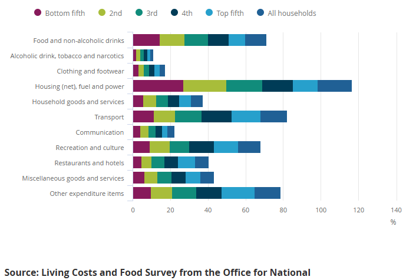

# 2025/W39 Family Spending in the UK

**Data (data.world):** [https://data.world/makeovermonday/2025w39-family-spending-in-the-uk](https://data.world/makeovermonday/2025w39-family-spending-in-the-uk)

**Article / original viz:** [https://www.ons.gov.uk/peoplepopulationandcommunity/personalandhouseholdfinances/expenditure/bulletins/familyspendingintheuk/april2023tomarch2024#data-sources-and-quality](https://www.ons.gov.uk/peoplepopulationandcommunity/personalandhouseholdfinances/expenditure/bulletins/familyspendingintheuk/april2023tomarch2024#data-sources-and-quality)

**Original data source:** [https://www.ons.gov.uk/peoplepopulationandcommunity/personalandhouseholdfinances/expenditure/bulletins/familyspendingintheuk/april2023tomarch2024#data-sources-and-quality](https://www.ons.gov.uk/peoplepopulationandcommunity/personalandhouseholdfinances/expenditure/bulletins/familyspendingintheuk/april2023tomarch2024#data-sources-and-quality)

**Dataset:** `makeovermonday/2025w39-family-spending-in-the-uk`  
**Last updated on data.world:** 2025-09-23T17:36:12.080260754Z

---

Average weekly household expenditure as a percentage of total weekly expenditure, by quintile group, UK, financial year

---
{"editor":"simple"}
---
# Original Vizualisation
​

Article: [ONS](https://www.ons.gov.uk/peoplepopulationandcommunity/personalandhouseholdfinances/expenditure/bulletins/familyspendingintheuk/april2023tomarch2024#data-sources-and-quality)

Data: [ONS](https://www.ons.gov.uk/peoplepopulationandcommunity/personalandhouseholdfinances/expenditure/bulletins/familyspendingintheuk/april2023tomarch2024#data-sources-and-quality)