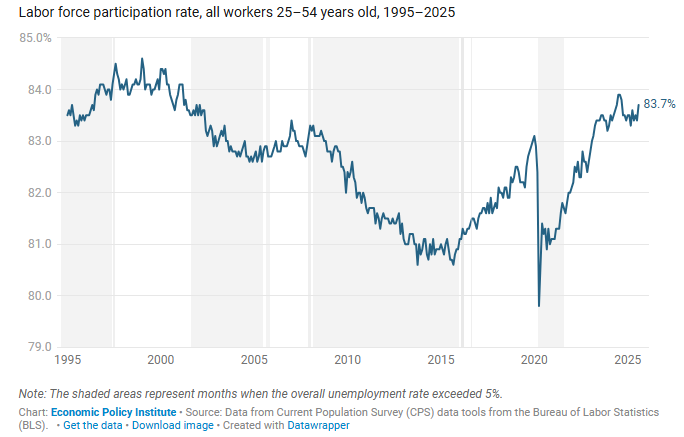

# 2025/W40 Better things come to those who wait

**Data (data.world):** [https://data.world/makeovermonday/better-things-come-to-those-who-wait](https://data.world/makeovermonday/better-things-come-to-those-who-wait)

**Article / original viz:** [https://www.epi.org/publication/better-things-come-to-those-who-wait-the-importance-of-patience-in-diagnosing-labor-force-participation-rates-and-prescribing-policy-solutions/](https://www.epi.org/publication/better-things-come-to-those-who-wait-the-importance-of-patience-in-diagnosing-labor-force-participation-rates-and-prescribing-policy-solutions/)

**Original data source:** [https://www.epi.org/publication/better-things-come-to-those-who-wait-the-importance-of-patience-in-diagnosing-labor-force-participation-rates-and-prescribing-policy-solutions/](https://www.epi.org/publication/better-things-come-to-those-who-wait-the-importance-of-patience-in-diagnosing-labor-force-participation-rates-and-prescribing-policy-solutions/)

**Dataset:** `makeovermonday/better-things-come-to-those-who-wait`  
**Last updated on data.world:** 2025-10-13T21:41:55.105894867Z

---

---
{"editor":"simple"}
---
# **Original Visualization**
​

​

Datasource and Article :  [Better things come to those who wait: The importance of patience in diagnosing labor force participation rates and prescribing policy solutions | Economic Policy Institute](https://www.epi.org/publication/better-things-come-to-those-who-wait-the-importance-of-patience-in-diagnosing-labor-force-participation-rates-and-prescribing-policy-solutions/)

​