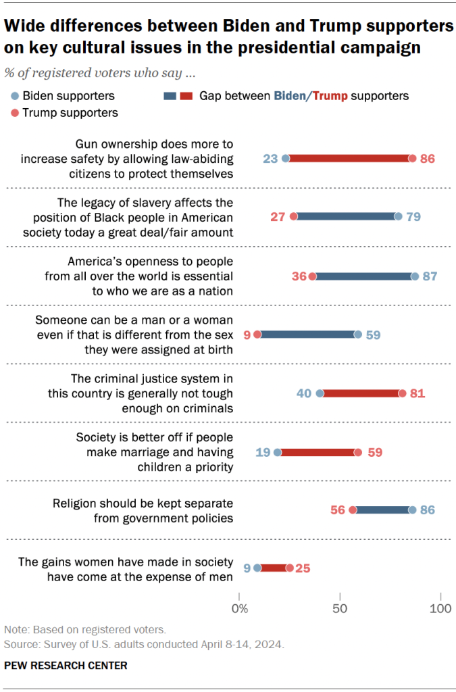

# 2025/W42 Cultural Issues and the 2024 Election

**Data (data.world):** [https://data.world/makeovermonday/2025w42-cultural-issues-and-the-2024-election](https://data.world/makeovermonday/2025w42-cultural-issues-and-the-2024-election)

**Article / original viz:** [https://www.pewresearch.org/politics/2024/06/06/cultural-issues-and-the-2024-election/](https://www.pewresearch.org/politics/2024/06/06/cultural-issues-and-the-2024-election/)

**Original data source:** [https://www.pewresearch.org/politics/2024/06/06/cultural-issues-and-the-2024-election/pp_2024-6-5_cultural-values_00-01/](https://www.pewresearch.org/politics/2024/06/06/cultural-issues-and-the-2024-election/pp_2024-6-5_cultural-values_00-01/)

**Dataset:** `makeovermonday/2025w42-cultural-issues-and-the-2024-election`  
**Last updated on data.world:** 2025-10-29T15:02:14.649878086Z

---

% of Registered Voters that say....

---
{"editor":"simple"}
---
# Original Visualization

Datasource: [Pew Research Center](https://www.pewresearch.org/politics/2024/06/06/cultural-issues-and-the-2024-election/pp_2024-6-5_cultural-values_00-01/)

Article: [Pew Research Center](https://www.pewresearch.org/politics/2024/06/06/cultural-issues-and-the-2024-election/)