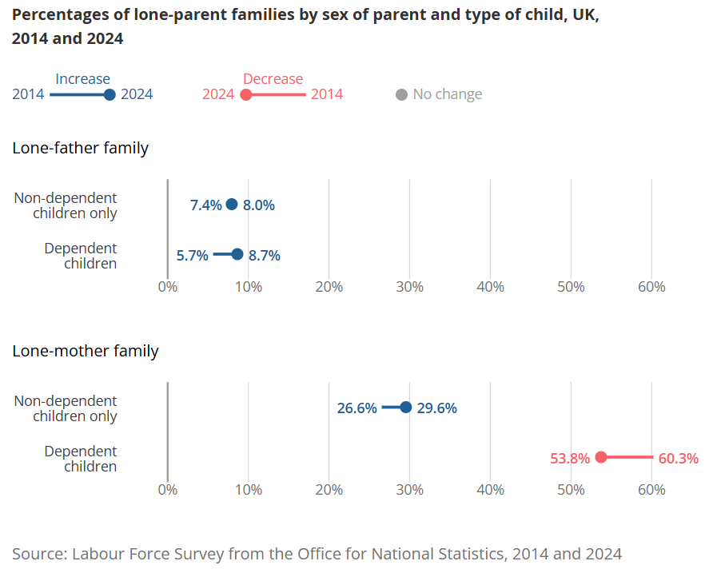

# Families and households in the UK: 2024

**Data (data.world):** [https://data.world/makeovermonday/families-and-households-in-the-uk-2024](https://data.world/makeovermonday/families-and-households-in-the-uk-2024)

**Article / original viz:** [https://www.ons.gov.uk/peoplepopulationandcommunity/birthsdeathsandmarriages/families/bulletins/familiesandhouseholds/2024](https://www.ons.gov.uk/peoplepopulationandcommunity/birthsdeathsandmarriages/families/bulletins/familiesandhouseholds/2024)

**Original data source:** [https://www.ons.gov.uk/peoplepopulationandcommunity/birthsdeathsandmarriages/families/bulletins/familiesandhouseholds/2024](https://www.ons.gov.uk/peoplepopulationandcommunity/birthsdeathsandmarriages/families/bulletins/familiesandhouseholds/2024)

**Dataset:** `makeovermonday/families-and-households-in-the-uk-2024`  
**Last updated on data.world:** 2025-11-04T16:10:54.475230219Z

---

Estimates of families (with and without children) and household types, including people living alone in the UK in 2024.

---
{"editor":"simple"}
---
# **Original Visualization**

Datasource & Article :  [Families and households in the UK - Office for National Statistics](https://www.ons.gov.uk/peoplepopulationandcommunity/birthsdeathsandmarriages/families/bulletins/familiesandhouseholds/2024)