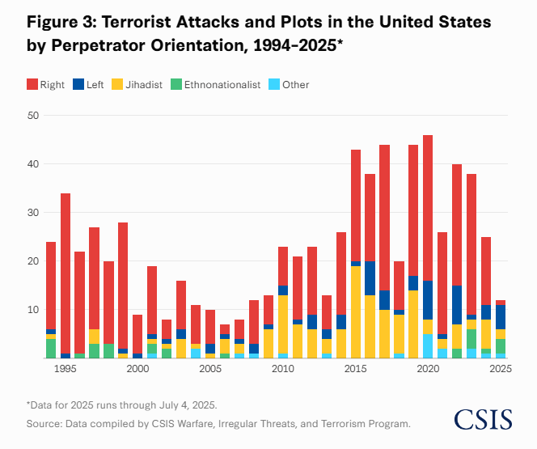

# 2025/W45 Terrorism and Political Violence in the USA

**Data (data.world):** [https://data.world/makeovermonday/2025w45-terrorism-and-political-violence-in-the-usa](https://data.world/makeovermonday/2025w45-terrorism-and-political-violence-in-the-usa)

**Article / original viz:** [https://www.csis.org/analysis/left-wing-terrorism-and-political-violence-united-states-what-data-tells-us](https://www.csis.org/analysis/left-wing-terrorism-and-political-violence-united-states-what-data-tells-us)

**Original data source:** [https://www.csis.org/analysis/left-wing-terrorism-and-political-violence-united-states-what-data-tells-us#h2-appendix-what-is-excluded-](https://www.csis.org/analysis/left-wing-terrorism-and-political-violence-united-states-what-data-tells-us#h2-appendix-what-is-excluded-)

**Dataset:** `makeovermonday/2025w45-terrorism-and-political-violence-in-the-usa`  
**Last updated on data.world:** 2025-11-17T10:14:42.704269734Z

---

Terrorist Attacks and Plots in the United States by Perpetrator Orientation, 1994–2025

---
{"editor":"simple"}
---
# Original Visualization

Datasource: [CSIS](https://www.csis.org/analysis/left-wing-terrorism-and-political-violence-united-states-what-data-tells-us#h2-appendix-what-is-excluded-)

Article: [CSIS](https://www.csis.org/analysis/left-wing-terrorism-and-political-violence-united-states-what-data-tells-us)