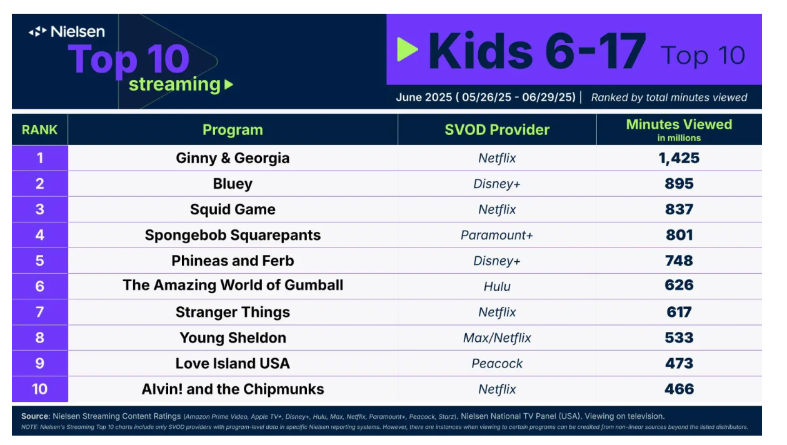

# 2025/WK46 School’s out and the TV’s on

**Data (data.world):** [https://data.world/makeovermonday/schools-out-and-the-tvs-on](https://data.world/makeovermonday/schools-out-and-the-tvs-on)

**Article / original viz:** [https://www.nielsen.com/insights/2025/what-us-kids-watched-tv-streaming-summer-june/](https://www.nielsen.com/insights/2025/what-us-kids-watched-tv-streaming-summer-june/)

**Original data source:** [https://www.nielsen.com/insights/2025/what-us-kids-watched-tv-streaming-summer-june/](https://www.nielsen.com/insights/2025/what-us-kids-watched-tv-streaming-summer-june/)

**Dataset:** `makeovermonday/schools-out-and-the-tvs-on`  
**Last updated on data.world:** 2025-11-25T00:15:47.221401305Z

---

What kids in the U.S. watched in June 2025

---
{"editor":"simple"}
---
# **Original Visualization**

​

Datasource and Article : [School’s out and the TV’s on: What kids in the U.S. watched in June | Nielsen](https://www.nielsen.com/insights/2025/what-us-kids-watched-tv-streaming-summer-june/)

​