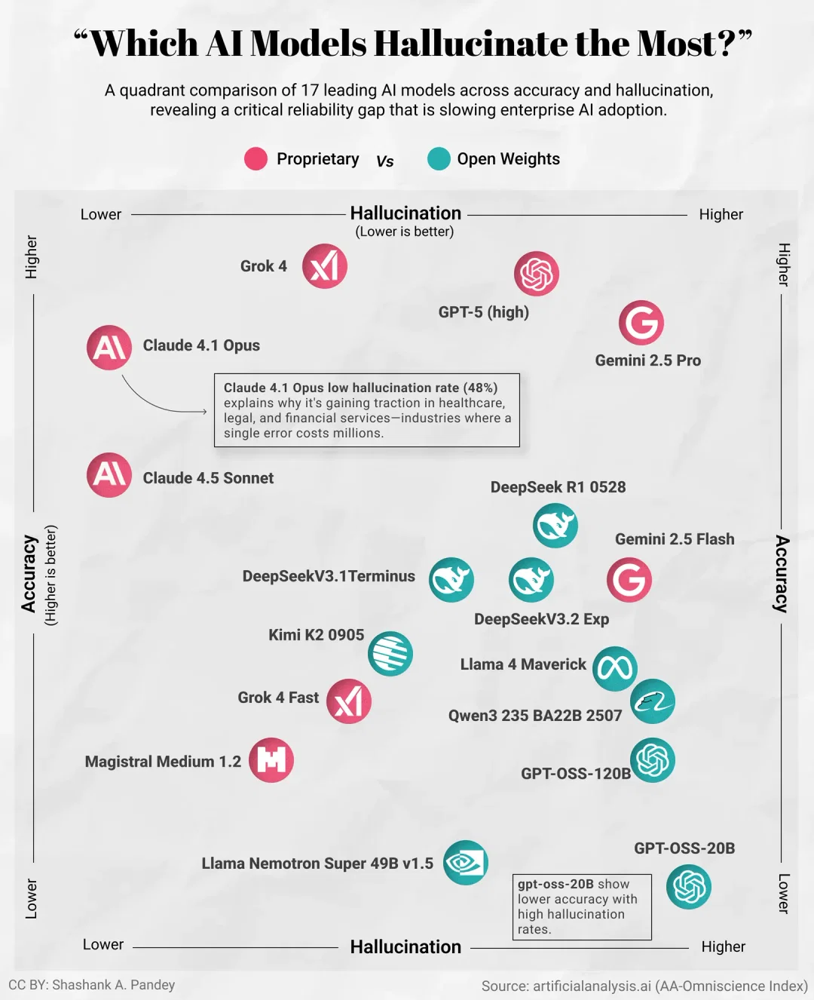

# 2025/WK48 Which AI Models Hallucinate the Most?

**Data (data.world):** [https://data.world/makeovermonday/2025wk48-which-ai-models-hallucinate-the-most](https://data.world/makeovermonday/2025wk48-which-ai-models-hallucinate-the-most)

**Article / original viz:** [https://bit.ly/4agYZ1j](https://bit.ly/4agYZ1j)

**Original data source:** [http://bit.ly/4seKkKP](http://bit.ly/4seKkKP)

**Dataset:** `makeovermonday/2025wk48-which-ai-models-hallucinate-the-most`  
**Last updated on data.world:** 2025-12-09T16:25:53.392748934Z

---

A Look into which AI models have higher rates of accuracy / hallucination

---
{"editor":"simple"}
---
# **Original Visualization**

​

Datasource and Article : [Which AI Models Hallucinate the Most? - Voronoi](https://www.voronoiapp.com/technology/Which-AI-Models-Hallucinate-the-Most-7211)