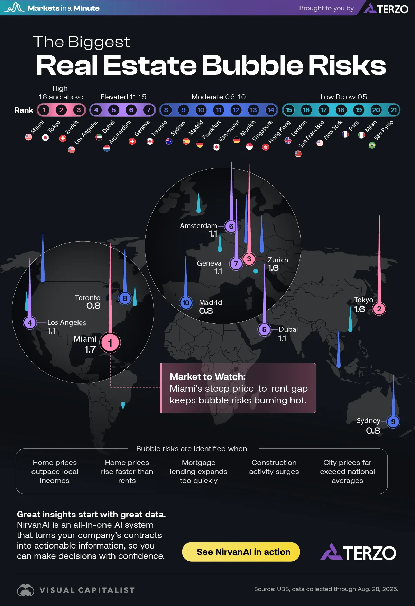

# 2026/WK2 The Biggest Housing Bubble Risks Globally

**Data (data.world):** [https://data.world/makeovermonday/2026wk2-the-biggest-housing-bubble-risks-globally](https://data.world/makeovermonday/2026wk2-the-biggest-housing-bubble-risks-globally)

**Article / original viz:** [https://www.visualcapitalist.com/sp/ter01-the-biggest-housing-bubble-risks-globally/](https://www.visualcapitalist.com/sp/ter01-the-biggest-housing-bubble-risks-globally/)

**Original data source:** [https://www.visualcapitalist.com/sp/ter01-the-biggest-housing-bubble-risks-globally/](https://www.visualcapitalist.com/sp/ter01-the-biggest-housing-bubble-risks-globally/)

**Dataset:** `makeovermonday/2026wk2-the-biggest-housing-bubble-risks-globally`  
**Last updated on data.world:** 2026-01-12T15:43:16.233313717Z

---

Exploring the level of housing bubble risk for major cities globally

---
{"editor":"simple"}
---
# **Original Visualization**
​

​

Datasource & Article :  [Housing Bubble Risks: Mapping the 2025 Landscape](https://www.visualcapitalist.com/sp/ter01-the-biggest-housing-bubble-risks-globally/)