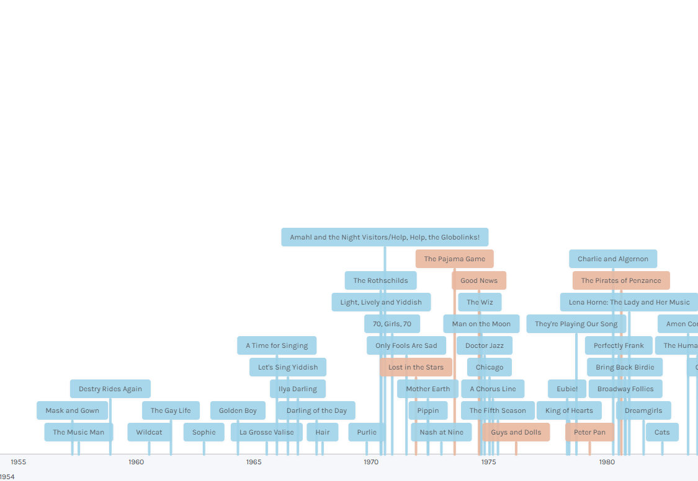

# 2026/W3 Women+ Conductors on Broadway

**Data (data.world):** [https://data.world/makeovermonday/2026w3-women-conductors-on-broadway](https://data.world/makeovermonday/2026w3-women-conductors-on-broadway)

**Article / original viz:** [https://maestramusic.org/resources/timelines/timeline-of-broadway-conductors-and-mds/](https://maestramusic.org/resources/timelines/timeline-of-broadway-conductors-and-mds/)

**Original data source:** [https://docs.google.com/spreadsheets/d/1yTUUKoOhpSiizZNHDZYoPMZL0Jdk7PSw/edit?gid=87507842#gid=87507842](https://docs.google.com/spreadsheets/d/1yTUUKoOhpSiizZNHDZYoPMZL0Jdk7PSw/edit?gid=87507842#gid=87507842)

**Dataset:** `makeovermonday/2026w3-women-conductors-on-broadway`  
**Last updated on data.world:** 2026-01-19T09:13:55.066451345Z

---

Representation of female and nonbinary conductors, music directors, and music supervisors in Broadway.

---
{"editor":"simple"}
---
# Original Vizualisation

Data Source: [Sariva Goetz](https://docs.google.com/spreadsheets/d/1yTUUKoOhpSiizZNHDZYoPMZL0Jdk7PSw/edit?gid=87507842#gid=87507842)

Article: [Maestra](https://maestramusic.org/resources/timelines/timeline-of-broadway-conductors-and-mds/)
Women+ Conduct on Broadway Data Visualization Contest: [Submission Form](https://docs.google.com/forms/d/e/1FAIpQLSeDsKbCsCmyzg30W7rUC3wmXOYVSEZiR1jTKGanNLjE8U9o_Q/viewform)
Women+ Conduct on Broadway Data Visualization Contest: [Livestream](https://www.youtube.com/live/ZDTnKAenlno)