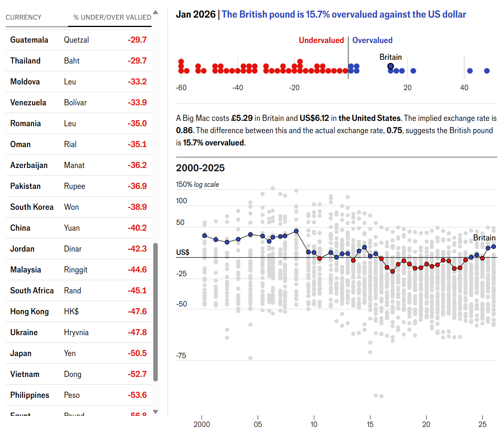

# 2026/W6 Global Big Mac Index

**Data (data.world):** [https://data.world/makeovermonday/2026w6-global-big-mac-index](https://data.world/makeovermonday/2026w6-global-big-mac-index)

**Article / original viz:** [https://www.economist.com/interactive/big-mac-index](https://www.economist.com/interactive/big-mac-index)

**Original data source:** [https://www.economist.com/interactive/big-mac-index](https://www.economist.com/interactive/big-mac-index)

**Dataset:** `makeovermonday/2026w6-global-big-mac-index`  
**Last updated on data.world:** 2026-02-09T17:50:54.035388258Z

---

The Big Mac Index showcases pricing differences across countries to demonstrate purchasing-power parity across nations.

---
{"editor":"simple"}
---

Data Source: The Economist (https://www.economist.com/interactive/big-mac-index)

Data Description: https://github.com/TheEconomist/big-mac-data?tab=readme-ov-file