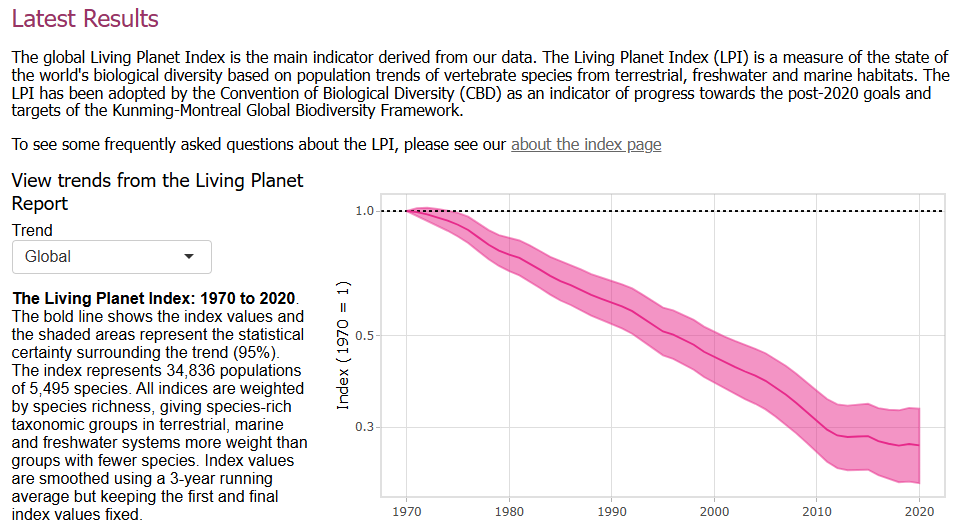

# 2026/W7 Living Planet Index

**Data (data.world):** [https://data.world/makeovermonday/2026w7-living-planet-index](https://data.world/makeovermonday/2026w7-living-planet-index)

**Article / original viz:** [https://livingplanet.panda.org/en-GB/](https://livingplanet.panda.org/en-GB/)

**Original data source:** [https://www.livingplanetindex.org/latest_results](https://www.livingplanetindex.org/latest_results)

**Dataset:** `makeovermonday/2026w7-living-planet-index`  
**Last updated on data.world:** 2026-02-15T09:58:04.806965601Z

---

A measure of the state of the world's biological diversity based on population trends of vertebrate species.

---
{"editor":"simple"}
---
# Original Vizualisation

Data Source: [ZSL & WWF](https://www.livingplanetindex.org/latest_results)

Article: [WWF](https://livingplanet.panda.org/en-GB/)