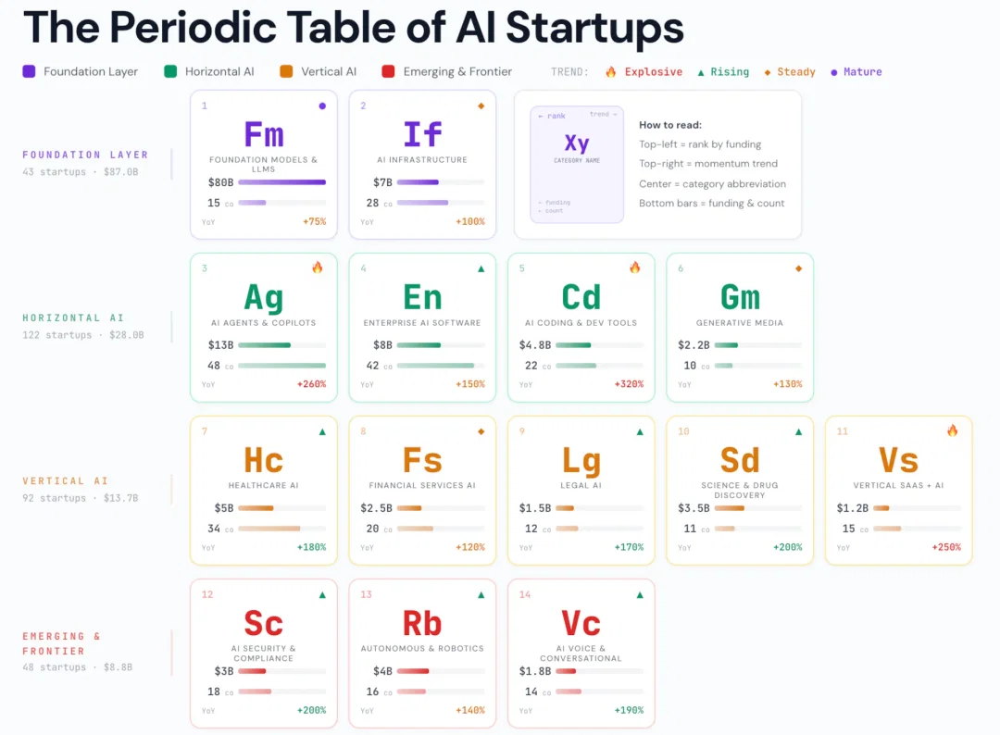

# 2026/WK 8 The Periodic Table of AI Startups

**Data (data.world):** [https://data.world/makeovermonday/2026wk-8-the-periodic-table-of-ai-startups](https://data.world/makeovermonday/2026wk-8-the-periodic-table-of-ai-startups)

**Article / original viz:** [https://www.voronoiapp.com/investing/The-Periodic-Table-of-AI-Startups--14-categories-of-AI-companies-foundedfunded-Feb-2025-Feb-2026-7663](https://www.voronoiapp.com/investing/The-Periodic-Table-of-AI-Startups--14-categories-of-AI-companies-foundedfunded-Feb-2025-Feb-2026-7663)

**Original data source:** [https://www.voronoiapp.com/investing/The-Periodic-Table-of-AI-Startups--14-categories-of-AI-companies-foundedfunded-Feb-2025-Feb-2026-7663](https://www.voronoiapp.com/investing/The-Periodic-Table-of-AI-Startups--14-categories-of-AI-companies-foundedfunded-Feb-2025-Feb-2026-7663)

**Dataset:** `makeovermonday/2026wk-8-the-periodic-table-of-ai-startups`  
**Last updated on data.world:** 2026-02-23T17:13:22.538496023Z

---

---
{"editor":"simple"}
---
# **Original Visualization**

​

Datasource & Article :  [The Periodic Table of AI Startups – 14 categories of AI companies founded/funded Feb 2025-Feb 2026 - Voronoi](https://www.voronoiapp.com/investing/The-Periodic-Table-of-AI-Startups--14-categories-of-AI-companies-foundedfunded-Feb-2025-Feb-2026-7663)