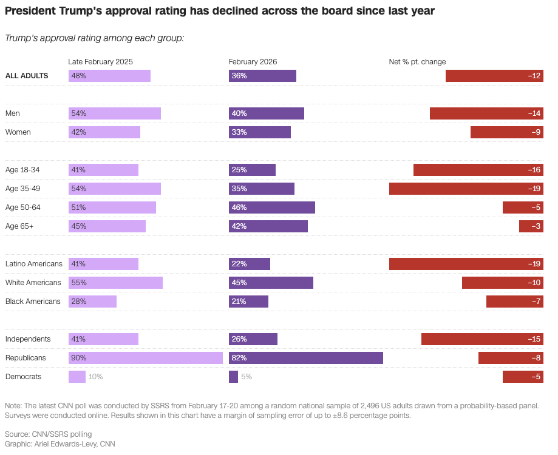

# 2026/W9 Trump's Approval Ratings

**Data (data.world):** [https://data.world/makeovermonday/2026w9-trumps-approval-ratings](https://data.world/makeovermonday/2026w9-trumps-approval-ratings)

**Article / original viz:** [https://edition.cnn.com/2026/02/23/politics/trump-approval-rating-independents-cnn-poll](https://edition.cnn.com/2026/02/23/politics/trump-approval-rating-independents-cnn-poll)

**Original data source:** [https://edition.cnn.com/2026/02/23/politics/trump-approval-rating-independents-cnn-poll](https://edition.cnn.com/2026/02/23/politics/trump-approval-rating-independents-cnn-poll)

**Dataset:** `makeovermonday/2026w9-trumps-approval-ratings`  
**Last updated on data.world:** 2026-03-02T02:08:53.487041033Z

---

Comparing Trump's approval ratings across groups between February 2025 and February 2026.

---
{"editor":"simple"}
---
# Original Visualization

Article: [CNN](https://edition.cnn.com/2026/02/23/politics/trump-approval-rating-independents-cnn-poll)