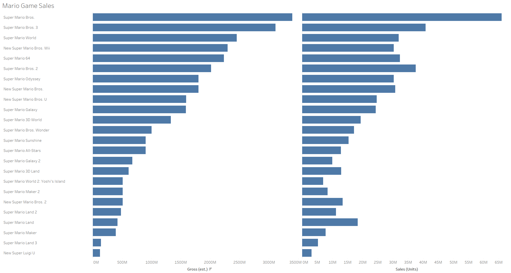

# 2026/W10 Mario Game Sales

**Data (data.world):** [https://data.world/makeovermonday/2026w10-mario-game-sales](https://data.world/makeovermonday/2026w10-mario-game-sales)

**Article / original viz:** [https://vgsales.fandom.com/wiki/Mario#cite_note-vc-27](https://vgsales.fandom.com/wiki/Mario#cite_note-vc-27)

**Original data source:** [https://vgsales.fandom.com/wiki/Mario#cite_note-vc-27](https://vgsales.fandom.com/wiki/Mario#cite_note-vc-27)

**Dataset:** `makeovermonday/2026w10-mario-game-sales`  
**Last updated on data.world:** 2026-03-09T13:22:21.583450343Z

---

A history of all major Mario game sales by Nintendo

---
{"editor":"simple"}
---
# **Original Visualization (sample)**

​

Source: [Fandom](https://vgsales.fandom.com/wiki/Mario#cite_note-vc-27)