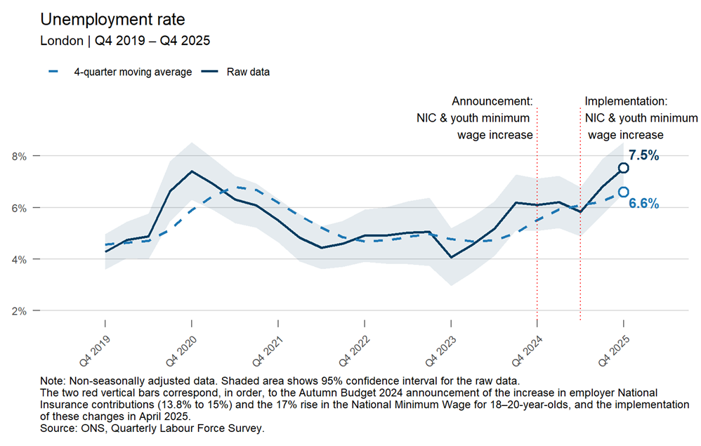

# 2026/W12 London Unemployment Estimates

**Data (data.world):** [https://data.world/makeovermonday/2026w12-uk-unemployment-estimates](https://data.world/makeovermonday/2026w12-uk-unemployment-estimates)

**Article / original viz:** [https://data.london.gov.uk/blog/unemployment-in-key-charts-young-londoners-hit-hardest-by-labour-market-slowdown/](https://data.london.gov.uk/blog/unemployment-in-key-charts-young-londoners-hit-hardest-by-labour-market-slowdown/)

**Original data source:** [https://www.ons.gov.uk/employmentandlabourmarket/peoplenotinwork/unemployment/datasets/regionalunemploymentbyagex02](https://www.ons.gov.uk/employmentandlabourmarket/peoplenotinwork/unemployment/datasets/regionalunemploymentbyagex02)

**Dataset:** `makeovermonday/2026w12-uk-unemployment-estimates`  
**Last updated on data.world:** 2026-03-23T14:40:30.365488351Z

---

Labour Force Survey (LFS) estimates for unemployment in London - Not Seasonally Adjusted

---
{"editor":"simple"}
---
# Original Vizualisation

Data Source: [ONS](https://www.ons.gov.uk/employmentandlabourmarket/peoplenotinwork/unemployment/datasets/regionalunemploymentbyagex02)

Article: [BBC](https://www.bbc.co.uk/news/articles/cm2rmjnlm94o) & [London Datastore](https://data.london.gov.uk/blog/unemployment-in-key-charts-young-londoners-hit-hardest-by-labour-market-slowdown/)