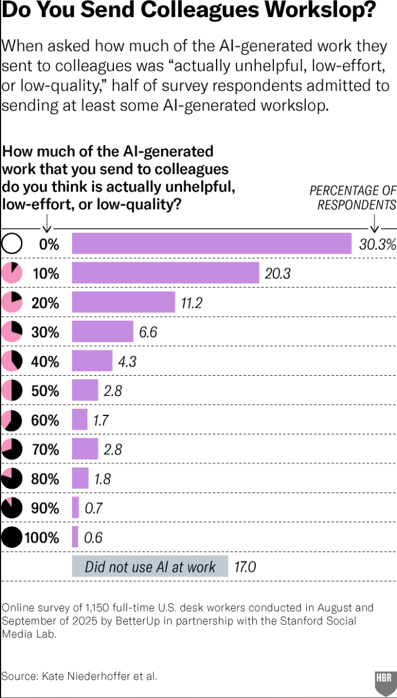

# 2026/W13 AI Workslop

**Data (data.world):** [https://data.world/makeovermonday/2026w13-ai-workslop](https://data.world/makeovermonday/2026w13-ai-workslop)

**Article / original viz:** [https://hbr.org/2026/01/why-people-create-ai-workslop-and-how-to-stop-it](https://hbr.org/2026/01/why-people-create-ai-workslop-and-how-to-stop-it)

**Original data source:** [https://hbr.org/resources/images/article_assets/2026/01/W260114_NEIDERHOFFER_AI_WORKSLOP_360.png](https://hbr.org/resources/images/article_assets/2026/01/W260114_NEIDERHOFFER_AI_WORKSLOP_360.png)

**Dataset:** `makeovermonday/2026w13-ai-workslop`  
**Last updated on data.world:** 2026-03-30T13:04:28.250941083Z

---

Data sourced from a survey about how frequently US desk workers send low quality AI generated work slop to colleagues

---
{"editor":"simple"}
---
