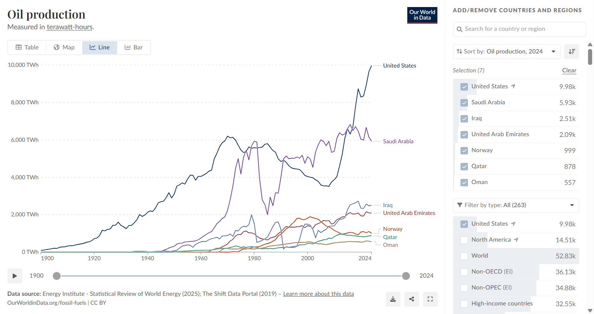

# 2026/W14

**Data (data.world):** [https://data.world/makeovermonday/2026w14](https://data.world/makeovermonday/2026w14)

**Article / original viz:** [https://ourworldindata.org/grapher/oil-production-by-country](https://ourworldindata.org/grapher/oil-production-by-country)

**Original data source:** [https://ourworldindata.org/grapher/oil-production-by-country](https://ourworldindata.org/grapher/oil-production-by-country)

**Dataset:** `makeovermonday/2026w14`  
**Last updated on data.world:** 2026-04-06T13:12:17.861224378Z

---

Oil production data over time.

---
{"editor":"simple"}
---
Source: https://ourworldindata.org/grapher/oil-production-by-country

