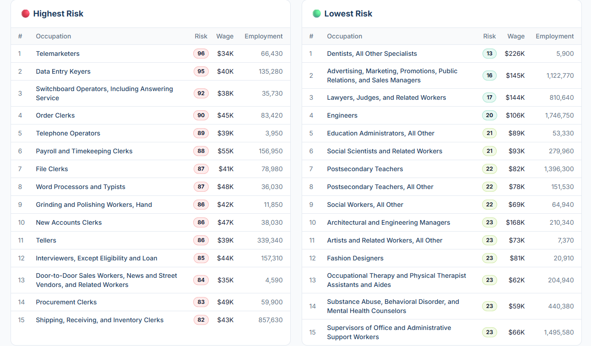

# 2026/WK 16 AI Risk Rankings

**Data (data.world):** [https://data.world/makeovermonday/ai-risk-rankings](https://data.world/makeovermonday/ai-risk-rankings)

**Article / original viz:** [https://www.aiexposure.org/rankings](https://www.aiexposure.org/rankings)

**Original data source:** [https://www.aiexposure.org/rankings](https://www.aiexposure.org/rankings)

**Dataset:** `makeovermonday/ai-risk-rankings`  
**Last updated on data.world:** 2026-04-20T16:26:24.408695935Z

---

Occupations ranked by AI automation risk, wages, employment, and projected growth.

---
{"editor":"simple"}
---
# Original Visualization

Source: [AI Risk Rankings — Highest & Lowest Risk Jobs | AI Exposure](https://www.aiexposure.org/rankings)