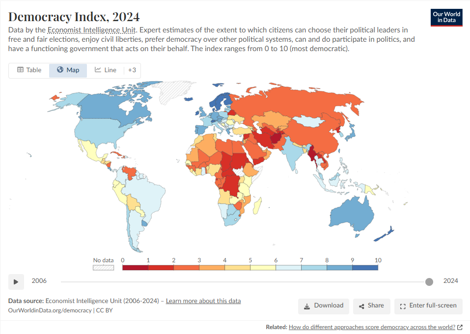

# 2026/W17 2024 EIU Democracy Index

**Data (data.world):** [https://data.world/makeovermonday/2026w17-2024-eiu-democracy-index](https://data.world/makeovermonday/2026w17-2024-eiu-democracy-index)

**Article / original viz:** [https://www.eiu.com/n/campaigns/democracy-index-2024/](https://www.eiu.com/n/campaigns/democracy-index-2024/)

**Original data source:** [https://ourworldindata.org/grapher/democracy-index-eiu](https://ourworldindata.org/grapher/democracy-index-eiu)

**Dataset:** `makeovermonday/2026w17-2024-eiu-democracy-index`  
**Last updated on data.world:** 2026-04-26T11:45:43.628977113Z

---

2024 Democracy Index and sub-indicators from the Economist Intelligence Unit.

---
{"editor":"simple"}
---
# Original Vizualisation

Data Source: [OurWorldInData](https://ourworldindata.org/grapher/democracy-index-eiu)

Article: [The Economist](https://www.eiu.com/n/campaigns/democracy-index-2024/)