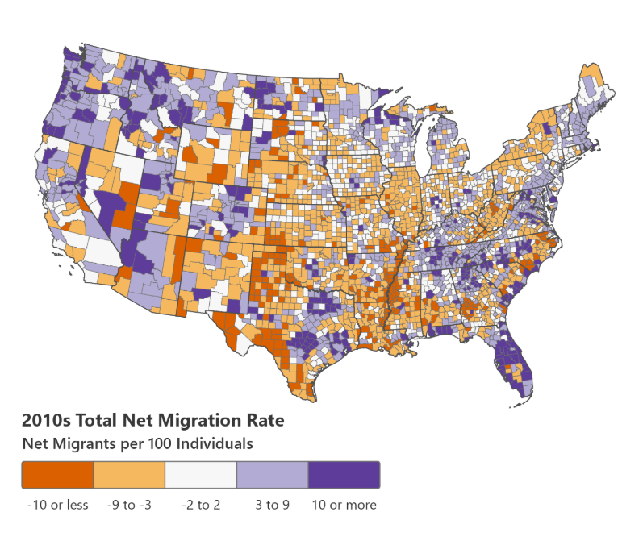

# 2026/W19 US Population Migration

**Data (data.world):** [https://data.world/makeovermonday/2026w19-us-population-migration](https://data.world/makeovermonday/2026w19-us-population-migration)

**Article / original viz:** [https://netmigration.wisc.edu/](https://netmigration.wisc.edu/)

**Original data source:** [https://www.wisc.edu/](https://www.wisc.edu/)

**Dataset:** `makeovermonday/2026w19-us-population-migration`  
**Last updated on data.world:** 2026-05-11T13:37:20.935398978Z

---

From 2010 through 2019, the data shows the US county level population migration by gender

---
{"editor":"simple"}
---
