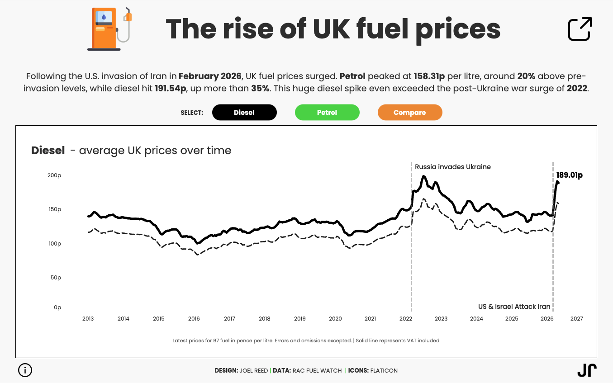

# 2026/w20 UK Fuel Prices

**Data (data.world):** [https://data.world/makeovermonday/2026w20-uk-fuel-prices](https://data.world/makeovermonday/2026w20-uk-fuel-prices)

**Article / original viz:** [https://www.rac.co.uk/drive/advice/fuel-watch/](https://www.rac.co.uk/drive/advice/fuel-watch/)

**Original data source:** [https://www.rac.co.uk/drive/advice/fuel-watch/](https://www.rac.co.uk/drive/advice/fuel-watch/)

**Dataset:** `makeovermonday/2026w20-uk-fuel-prices`  
**Last updated on data.world:** 2026-05-18T13:27:08.840023953Z

---

UK fuel prices recorded every other week

---
{"editor":"simple"}
---

​

Source: https://www.rac.co.uk/drive/advice/fuel-watch/

Inspired by: https://public.tableau.com/app/profile/joelreed/viz/UK-Fuel-Prices-2013-2026/TheRiseofUKFuelPrices2013-2026