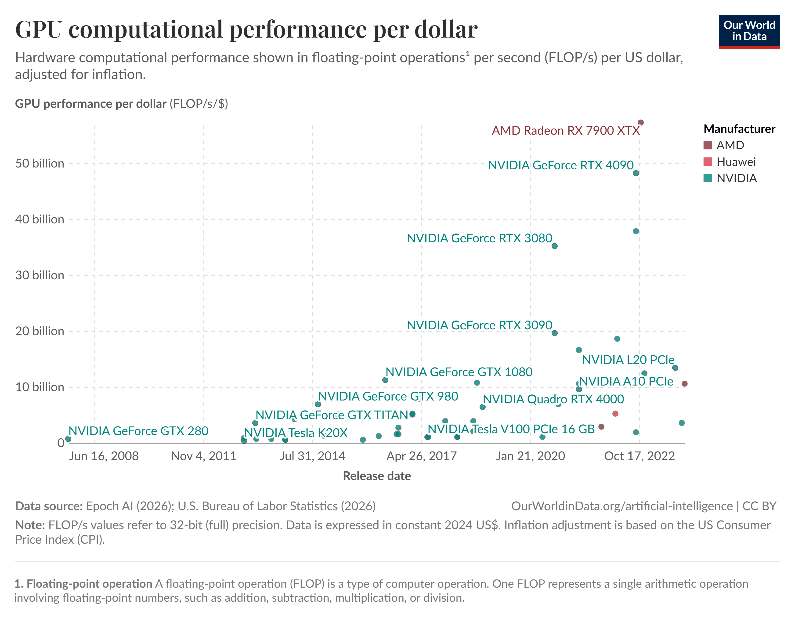

# 2026/w21 GPU computational performance per dollar

**Data (data.world):** [https://data.world/makeovermonday/gpu-computational-performance-per-dollar](https://data.world/makeovermonday/gpu-computational-performance-per-dollar)

**Article / original viz:** [https://ourworldindata.org/grapher/gpu-price-performance](https://ourworldindata.org/grapher/gpu-price-performance)

**Original data source:** [https://ourworldindata.org/grapher/gpu-price-performance](https://ourworldindata.org/grapher/gpu-price-performance)

**Dataset:** `makeovermonday/gpu-computational-performance-per-dollar`  
**Last updated on data.world:** 2026-05-25T18:43:58.659750959Z

---

Hardware computational performance shown in floating-point operations per second (FLOP/s) per US dollar

---
{"editor":"simple"}
---
# **Original Visualization**

​

Source: [GPU computational performance per dollar](https://ourworldindata.org/grapher/gpu-price-performance)